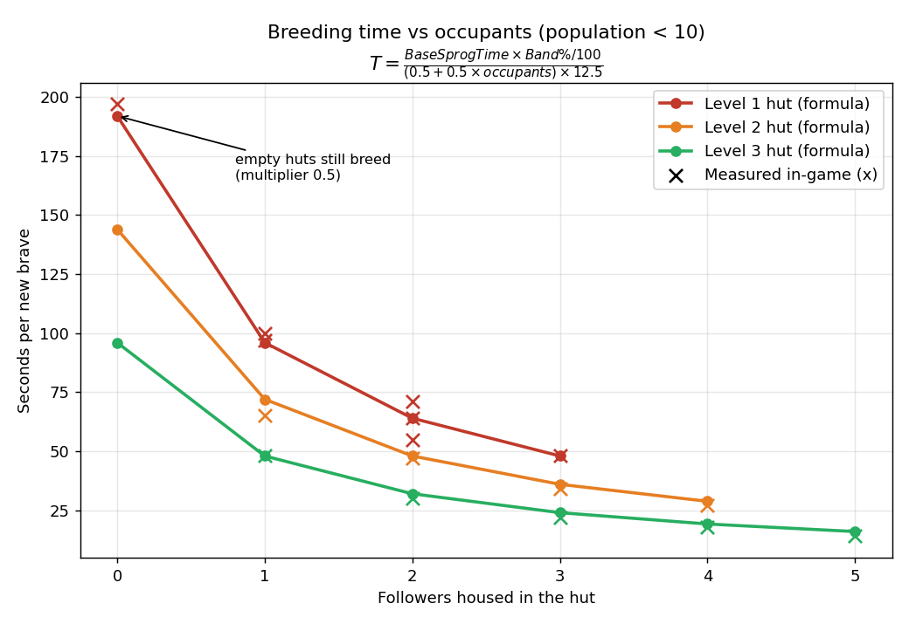
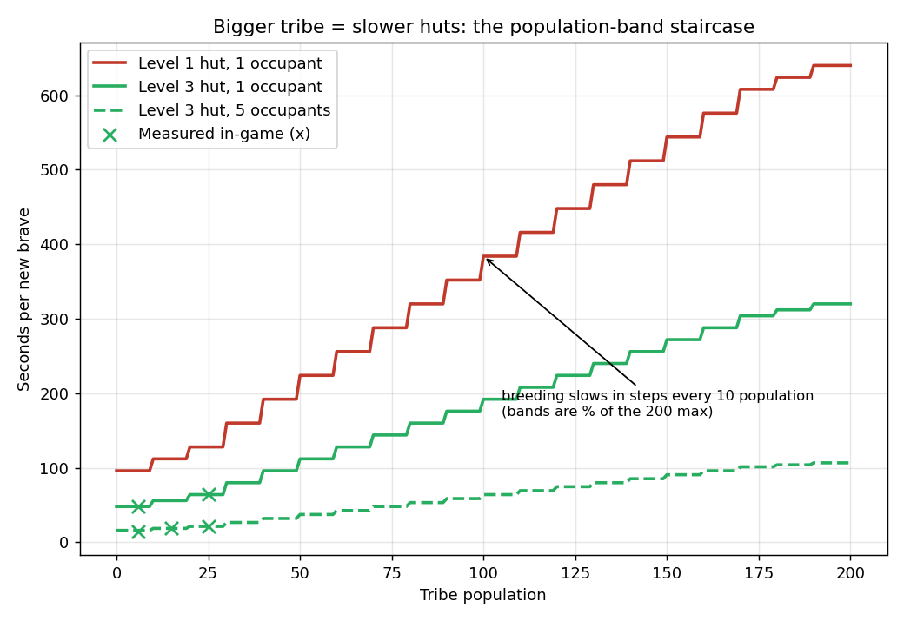
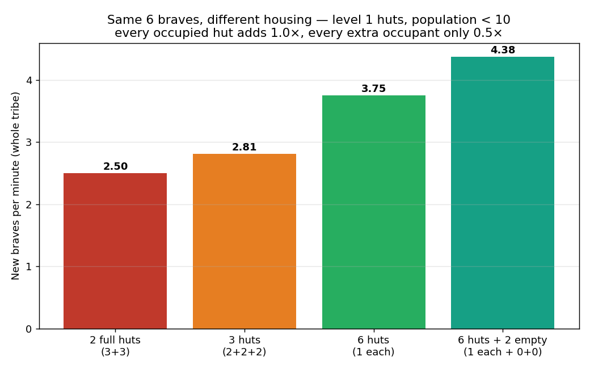
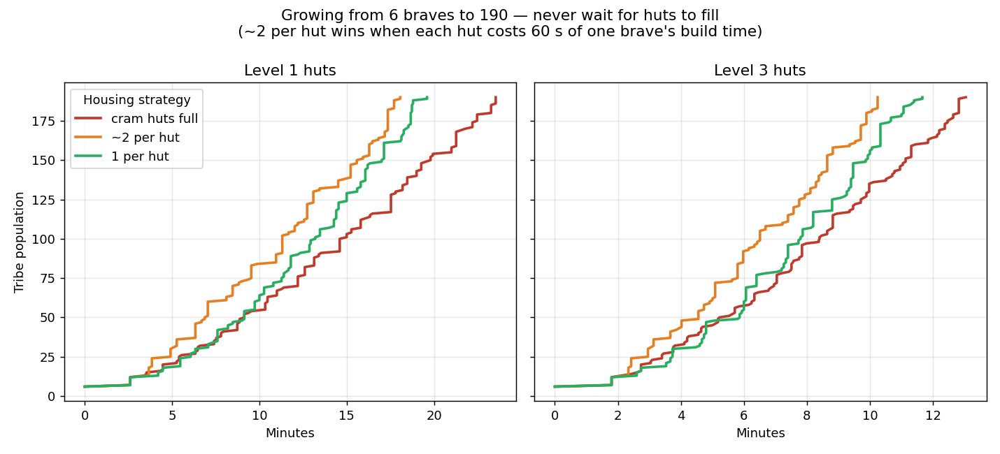

# Populous: The Beginning — Population Simulator

A reverse-engineered model of the hut breeding mechanics from **Populous: The Beginning** (Bullfrog/EA, 1998), built from the game's `constant.dat` values and verified with stopwatch measurements of actual in-game breeding times.

## The breeding formula

Breeding time in seconds:

```
T = (Base Sprog Time × Band% / 100) / (Hut Multiplier × 12.5)
```

| Term | Value |
|---|---|
| **Base Sprog Time** | 4000 / 3000 / 2000 for hut level 1 / 2 / 3 (`P3CONST_HUTn_SPROG_TIME`) |
| **Hut Multiplier** | `0.5 + 0.5 × occupants` — an **empty hut still breeds**, at half the rate of one occupant |
| **Band%** | `P3CONST_SPROG%_POP_BAND` value, selected by tribe population as a % of the 200 max (pop 0–9 → 30, 10–19 → 35, 20–29 → 40, … 190+ → 200). Bigger tribe ⇒ slower breeding |
| **12.5** | game turns per second (the only number not read directly from `constant.dat` — inferred from the timings; **see PS below**) |

Intuition: a hut needs `Base Sprog Time × Band%/100` "breeding points" for a birth and earns `Hut Multiplier` points per game turn.

> **PS — community correction on the tick rate:** Thanks to **IncaWarrior** on the Populous Reincarnated forum for pointing out that **the game operates at 12 ticks per second**, not 12.5 as inferred here. The best fit to the stopwatch measurements was ~12.4 (e.g. level 1 hut, 1 occupant: 97 s measured vs 100 s predicted at 12 t/s and 96 s at 12.5 t/s), so both values sit within measurement error and the code in this repo still uses 12.5. Substitute 12 if you want the engine-accurate value — all predictions simply shift by ~4%.

Mean error against the measured in-game times is **under 5%**, with several exact hits, and **no fitted constants**:





## Strategy findings

Each hut breeds at rate `0.5 + 0.5 × occupants`, so the tribe's total birth rate is proportional to **(occupied huts + housed population)** — the first follower into a new hut is worth twice as much as an extra follower in an existing hut.





In order of impact:

1. **Upgrade your huts** — level 3 breeds 2× as fast as level 1, and dominates everything else.
2. **Never wait for huts to fill** — more occupied huts always beats fuller huts; ~2 followers per hut is the sweet spot once build time counts.
3. **Build ahead of your population** — empty huts breed too.
4. **Do it early** — breeding slows in steps as the tribe grows, so early huts pay off the most.

## Running it

```bash
pip install simpy matplotlib

python formula_validation.py   # the formula vs all measured in-game data
python strategy_sim.py         # cram vs balanced vs spread comparison
python wiki_graphs.py          # regenerate the four graphs above
python asd.py                  # quick breeding-time calculator
python main.py                 # SimPy tribe-growth simulation
```

## Files

| File | Role |
|---|---|
| `formula_validation.py` | Tests formula candidates against all measured in-game data |
| `strategy_sim.py` | Event sim comparing hut-allocation strategies |
| `wiki_graphs.py` | Generates the four explanation graphs |
| `asd.py` | Minimal breeding-time calculator |
| `main.py` | SimPy simulation: breeding, hut levelling, population bands |
| `data fra pop.txt` | Research notes: raw constants and stopwatch measurements (Norwegian) |
| `archive/` | Historical experiments kept for context |

Made by a long-time fan with help from the Populous Reincarnated Discord community. Corrections welcome — and thanks to **IncaWarrior** for the tick-rate correction (see PS above).
